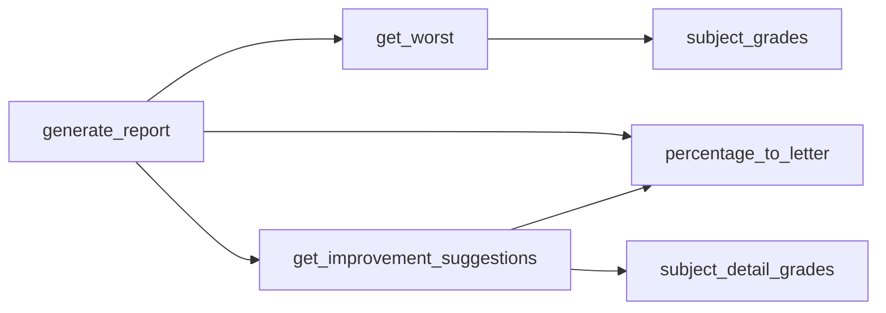

# Letter grade scale and worst-subject improvement suggestions

## To-do list (clear steps)

1. **Add grade scale in report.py** — Define `GRADE_BOUNDARIES` (e.g. `[(90, "A*"), (80, "A"), ...]`) and implement `percentage_to_letter(score)`.
2. **Add subject → detail mapping** — Create `subject_detail_grades = {"biology": biology_grades, "economics": economics_grades, ...}` so improvement logic can look up components by subject.
3. **Show letter grades in the report** — In `generate_report()`, display the letter next to the numeric score for best and worst subject (e.g. "Score: 85 (A)").
4. **Implement improvement suggestions** — Write `get_improvement_suggestions(subject_name, current_total, detail_dict, target_percentage)` that returns a list of strings; sort components by weight descending and apply the algorithm from section 4 of the plan (required score = current_score + gap/weight; if > 100, set to 100 and continue to next component).
5. **Wire improvement into the report** — In `generate_report()`, after printing worst subject(s), for each worst subject call `get_improvement_suggestions` and print the lines (handle A* and “already at target” edge cases).
6. **Test** — Run `run_all.py`, enter sample scores, and confirm letter grades and improvement messages appear correctly.

---

## 1. Letter grade scale (A* to U)

Define numeric boundaries and a single source of truth in [report.py](report.py):

- **A**: 90–100  
- **A**: 80–89  
- **B**: 70–79  
- **C**: 60–69  
- **D**: 50–59  
- **E**: 40–49  
- **U**: 0–39 (replacing F)

Implementation:

- Add a constant (e.g. `GRADE_BOUNDARIES`) as a list of `(min_percentage, letter)` from highest to lowest, e.g. `[(90, "A*"), (80, "A"), (70, "B"), ...]`, and a helper `percentage_to_letter(score)` that returns the letter for a given percentage. Use this for both subject totals and for any display of letter grades.

If your syllabus uses different boundaries for C/D/E/U, they can be adjusted in this single structure.

---

## 2. Use letter grades in the report

In `generate_report(subject_grades)` in [report.py](report.py):

- For each subject, compute its letter grade with `percentage_to_letter(total)` and show it in the summary (e.g. “Best subject: X, Score: 85 (A)” and “Worst subject: Y, Score: 72 (B)”).
- No change to how `get_best` / `get_worst` work; they still use numeric scores. Only the display and the improvement logic use letter grades.

---

## 3. Detail grades structure (existing)

Each subject has a detail dict already in [report.py](report.py), e.g.:

- `biology_grades`: `{ "BFL": [score, 0.1], "ongoing grade": [score, 0.3], ... }`
- Same pattern for `economics_grades`, `geography_grades`, `mathematics_grades`.

Subject total = sum over components of `(score * weight)`. We need a single mapping from subject name (as in `subject_grades`) to the corresponding detail dict so the improvement logic can look up components by subject.

---

## 4. Improvement suggestion algorithm (worst subject → next grade)

**Input:** One worst subject (name + current total percentage). If there are ties, run the same logic for each worst subject.

**Goal:** Tell the user which detail component(s) to improve, in order of **decreasing weight**, and what target percentage to aim for in each, so that the subject total reaches the **next** letter grade.

**Steps:**

1. **Current letter and target:** From the subject’s current percentage, get current letter (e.g. B). Define “next” grade (e.g. A); if already A*, say “already at top grade” and skip. Target percentage = minimum for that next grade (e.g. 80 for A).
2. **Gap:** `gap = target - current_total`. If `gap <= 0`, already at or above target → no suggestion. Otherwise we need to gain `gap` points.
3. **Detail list by weight:** Build a list of `(component_name, current_score, weight)` from the subject’s detail dict, sorted by **weight descending** (so highest-weight component first).
4. **Single-component sufficient?** For each component in that order:
  Contribution of this component to the total = `current_score * weight`.  
   If we change only this component to a new score `s`, the new total = `current_total - (current_score * weight) + s * weight`.  
   We need: `current_total - (current_score * weight) + s * weight >= target`  
   So: `s >= current_score + (target - current_total) / weight = current_score + gap / weight`.  
  - If `current_score + gap / weight <= 100`: improving this **one** component is enough. Report: “To reach [next letter], improve **[component name]** to at least **[ceil of that value]**%” (cap at 100). Stop.
  - If `current_score + gap / weight > 100`: even 100% in this component is not enough. Simulate setting this component to 100:  
    - `current_total += (100 - current_score) * weight`  
    - `gap = target - current_total`  
    If `gap <= 0`, we can say: “To reach [next letter], improve **[component name]** to 100%” and stop. Otherwise continue to the **next** component (same logic: required score for that component = `current_score + gap/weight`; if > 100, set to 100, update total and gap, and repeat).
5. **Output:** A short, ordered list of “improve X to at least Y%” (and “to 100%” when Y would exceed 100). All components in the list are in order of decreasing weight, so the user sees the highest-impact one first.

**Edge cases:**

- Already A*: message like “Already at the highest grade (A*)”.
- Already at or above target: “You have already reached [next grade] or higher.”
- If after considering all components we still have `gap > 0` (theoretically possible if weights don’t sum to 1 or rounding): report the list we have and add “You may also need to improve other components.”

---

## 5. Where to implement

- **File:** [report.py](report.py).
- **New pieces:**
  - `GRADE_BOUNDARIES` and `percentage_to_letter(score)`.
  - A mapping from subject key to detail dict, e.g. `subject_detail_grades = {"biology": biology_grades, "economics": economics_grades, "geography": geography_grades, "mathematics": mathematics_grades}`.
  - Function `get_improvement_suggestions(subject_name, current_total, detail_dict, target_percentage)` that returns a list of strings (e.g. `["Improve EOY to at least 88%", "Improve ongoing grade to 100%"]`).
  - In `generate_report`: after printing worst subject and score, get current letter and next grade threshold; if not A* and below threshold, call `get_improvement_suggestions` and print the returned lines (e.g. under “REDEEM YOURSELF!”). Handle multiple worst subjects by looping and showing suggestions for each.

---

## 6. Data flow (high level)

---

## 7. Biology “drop lowest test” nuance

In [bio.py](bio.py), the total uses **two** tests (lowest dropped); [report.py](report.py) stores all three in `biology_grades` as separate entries (Test1, Test2, Test3) each with weight 0.1. For the improvement algorithm we have two options:

- **Option A (simpler):** Treat each of the three test components as-is (each 0.1). The “improvement” suggestion might say to improve one or two of them; the math (subject total) is still correct because the current total was computed with the drop rule, and we’re only suggesting increases in specific components—we are not re-dropping in the suggestion logic.
- **Option B (strict):** When computing “required score” for a test component, account for the drop (e.g. improving the lowest test might not change the total if it stays the lowest). This is more accurate but more complex.

Recommendation: implement **Option A** first so the rest of the flow is consistent across subjects; the suggestion “improve Test2 to at least X%” remains meaningful. If you want strict drop-aware suggestions for biology later, we can add a special case in the improvement function for biology only.

---

## 8. Summary of changes

| Area              | Change                                                                                                                   |
| ----------------- | ------------------------------------------------------------------------------------------------------------------------ |
| Grade scale       | Add `GRADE_BOUNDARIES` and `percentage_to_letter()` in report.py                                                         |
| Report output     | Show letter grade next to best/worst subject score                                                                       |
| Improvement logic | New `get_improvement_suggestions()`; subject → detail dict mapping; call from `generate_report()` for each worst subject |
| Biology           | Use current detail dict as-is (Option A); optional later: drop-aware biology                                             |

No changes to [run_all.py](run_all.py), [bio.py](bio.py), [econ.py](econ.py), [geo.py](geo.py), or [maths.py](maths.py) are required unless you later add drop-aware biology logic in a separate step.